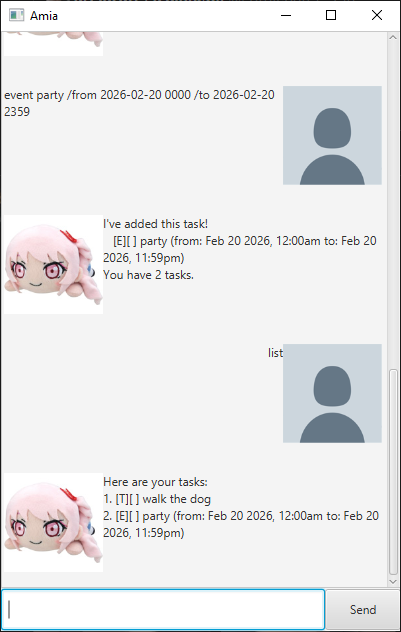

# Amia User Guide



Amia is a task management chatbot that helps you organize and track your tasks efficiently. Whether you need to manage simple to-dos, set deadlines, or schedule events, Amia is here to help!

## Introduction

Amia allows you to:

- **Create tasks** in three formats: simple to-dos, tasks with deadlines, and scheduled events
- **Organize your workflow** by marking tasks as complete
- **Find tasks quickly** using keyword search
- **Manage multiple tasks at once** with mass operations
- **Persist your data** automatically (all tasks are saved!)

Amia is available in both **command-line** and **GUI** versions, so choose whichever works best for you.

---

## Quick Start

### Running Amia

**GUI Version:** Double-click the Amia executable or run from your IDE
**CLI Version:** Run `.\gradlew run` from the command line

You'll see a welcome message from Amia, and you're ready to start!

---

## Features

### 1. Adding a Simple To-Do Task

Add a basic task without any specific deadline.

**Format:** `todo <description>`

**Examples:**

```
todo buy groceries
todo call mom
todo finish homework
```

**Expected Output:**

```
I've added this task!
   [T][ ] buy groceries
You have 1 task.
```

---

### 2. Adding a Task with a Deadline

Add a task that needs to be completed by a specific date and time.

**Format:** `deadline <description> /by <date and time>`

**Date/Time Format:** `yyyy-MM-dd HHmm` (e.g., `2025-03-15 1400` for 2:00 PM on March 15, 2025)

**Examples:**

```
deadline submit report /by 2025-02-28 2359
deadline finish project /by 2025-03-10 1600
deadline pay bills /by 2025-03-01 0900
```

**Expected Output:**

```
I've added this task!
   [D][ ] submit report (by: Feb 28 2025, 11:59PM)
You have 2 tasks.
```

---

### 3. Adding an Event

Add an event with a specific start and end time.

**Format:** `event <description> /from <start date and time> /to <end date and time>`

**Date/Time Format:** `yyyy-MM-dd HHmm`

**Examples:**

```
event team meeting /from 2025-03-05 1400 /to 2025-03-05 1530
event summer vacation /from 2025-06-01 0000 /to 2025-08-31 2359
event birthday party /from 2025-03-20 1800 /to 2025-03-20 2200
```

**Expected Output:**

```
I've added this task!
   [E][ ] team meeting (from: Mar 05 2025, 2:00PM to: Mar 05 2025, 3:30PM)
You have 3 tasks.
```

---

### 4. Listing All Tasks

View all your tasks in one place.

**Format:** `list`

**Example:**

```
list
```

**Expected Output:**

```
Here are your tasks:
1. [T][ ] buy groceries
2. [D][ ] submit report (by: Feb 28 2025, 11:59PM)
3. [E][ ] team meeting (from: Mar 05 2025, 2:00PM to: Mar 05 2025, 3:30PM)
```

---

### 5. Marking a Task as Done

Mark one or more tasks as complete.

**Format:** `mark <task number> [more numbers...]`

**Examples:**

```
mark 1
mark 2 3 5
```

**Expected Output (Single Task):**

```
I've marked the task as done!
   [T][X] buy groceries
```

**Expected Output (Multiple Tasks):**

```
I've marked these tasks as done:
   [D][X] submit report (by: Feb 28 2025, 11:59PM)
   [E][X] team meeting (from: Mar 05 2025, 2:00PM to: Mar 05 2025, 3:30PM)
   [T][X] call mom
```

---

### 6. Unmarking a Task

Mark a completed task as incomplete again.

**Format:** `unmark <task number> [more numbers...]`

**Examples:**

```
unmark 1
unmark 2 3
```

**Expected Output:**

```
I've marked the task as not done yet.
   [T][ ] buy groceries
```

---

### 7. Deleting a Task

Remove one or more tasks from your list.

**Format:** `delete <task number> [more numbers...]`

**Examples:**

```
delete 1
delete 2 4 6
```

**Expected Output (Single Task):**

```
I've removed this task:
   [T][ ] buy groceries
You have 2 tasks.
```

**Expected Output (Multiple Tasks):**

```
I've removed these tasks:
   [T][ ] read book
   [D][ ] submit report (by: Feb 28 2025, 11:59PM)
You have 1 task.
```

---

### 8. Finding Tasks

Search for tasks using keywords.

**Format:** `find <keyword>`

**Examples:**

```
find meeting
find buy
find project
```

**Expected Output:**

```
Here are the matching tasks:
1. [E][ ] team meeting (from: Mar 05 2025, 2:00PM to: Mar 05 2025, 3:30PM)
2. [E][ ] emergency meeting (from: Mar 10 2025, 10:00AM to: Mar 10 2025, 11:00AM)
```

---

### 9. Exiting Amia

Exit the application gracefully.

**Format:** `bye`

**Example:**

```
bye
```

**Expected Output:**

```
Bye!
```

---

## Task Format Legend

When you see a task displayed, here's what the symbols mean:

| Symbol | Meaning                   |
| ------ | ------------------------- |
| `[T]`  | To-Do task                |
| `[D]`  | Task with Deadline        |
| `[E]`  | Event                     |
| `[X]`  | Task is completed ✓       |
| `[ ]`  | Task is not yet completed |

**Example:** `[D][X] submit report (by: Feb 28 2025, 11:59PM)`

- This is a completed deadline task
- The task is to submit a report
- The deadline is February 28, 2025 at 11:59 PM

---

## FAQ

**Q: What happens if I enter an invalid command?**
A: Amia will let you know with an error message. Just try again with the correct format!

**Q: Can I edit an existing task?**
A: Currently, you can't edit tasks directly. Delete the task with `delete` and create a new one instead.

**Q: Is there a limit to how many tasks I can have?**
A: Yes, the maximum is 100 tasks. If you reach this limit, you'll need to delete some tasks before adding more.

**Q: Can I export my tasks?**
A: Currently, Amia saves tasks in an internal format. You can view all your tasks anytime using the `list` command.

---

## Command Quick Reference

| Command       | Format                                                  | Example                                                   |
| ------------- | ------------------------------------------------------- | --------------------------------------------------------- |
| **To-Do**     | `todo <description>`                                    | `todo buy groceries`                                      |
| **Deadline**  | `deadline <description> /by <date time>`                | `deadline report /by 2025-03-15 1400`                     |
| **Event**     | `event <description> /from <date time> /to <date time>` | `event meeting /from 2025-03-15 1400 /to 2025-03-15 1500` |
| **List**      | `list`                                                  | `list`                                                    |
| **Mark Done** | `mark <number> [more...]`                               | `mark 1 2 3`                                              |
| **Unmark**    | `unmark <number> [more...]`                             | `unmark 1`                                                |
| **Delete**    | `delete <number> [more...]`                             | `delete 2 4`                                              |
| **Find**      | `find <keyword>`                                        | `find meeting`                                            |
| **Exit**      | `bye`                                                   | `bye`                                                     |

---

## Troubleshooting

**Problem:** Dates aren't being recognized

- **Solution:** Make sure you're using the exact format `yyyy-MM-dd HHmm` (e.g., `2025-03-15 1430`)

**Problem:** Tasks aren't being saved

- **Solution:** Amia saves automatically after each command. Make sure the `data/` folder exists and Amia has write permissions to your system

**Problem:** Error message "Invalid task number"

- **Solution:** Make sure the task number exists in your list. Use `list` to see all your tasks and their numbers

**Problem:** Mass operations aren't working

- **Solution:** Separate task numbers with spaces. For example: `delete 1 2 3` (not `delete 1,2,3`)
